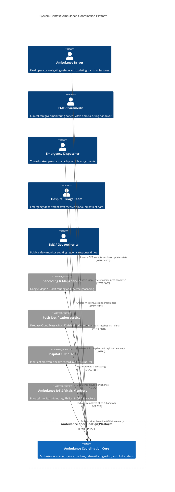
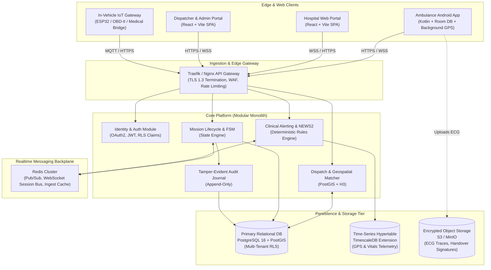
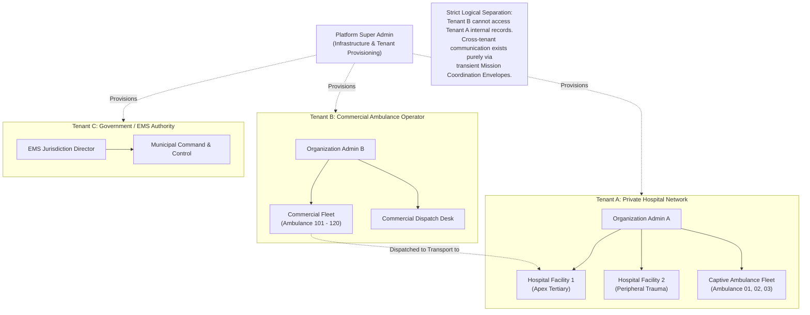
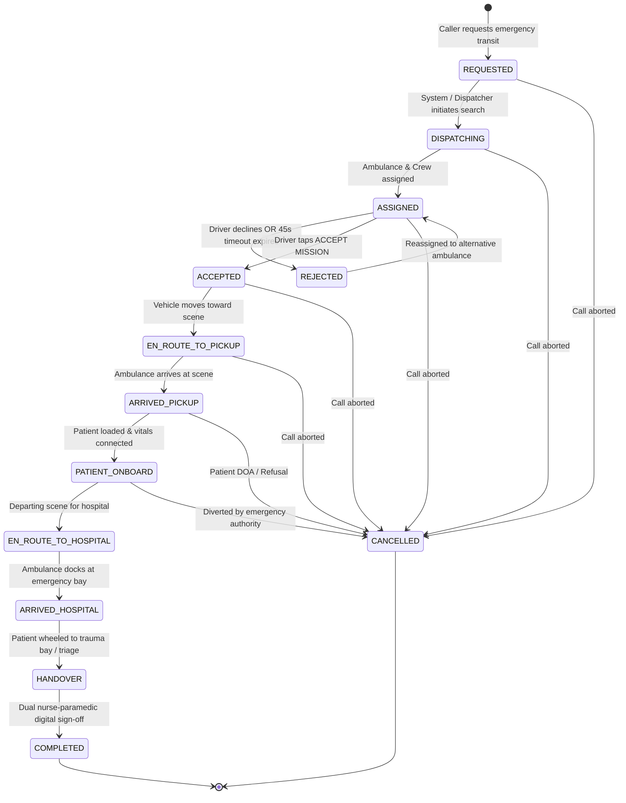
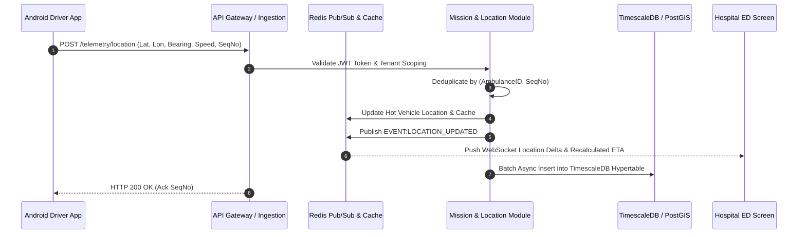
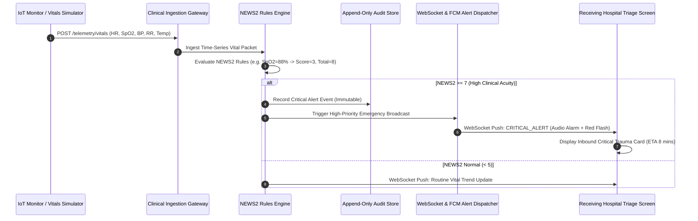
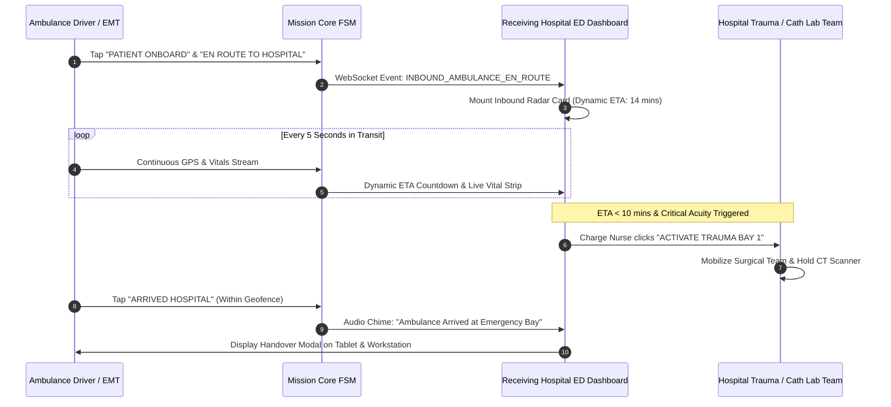
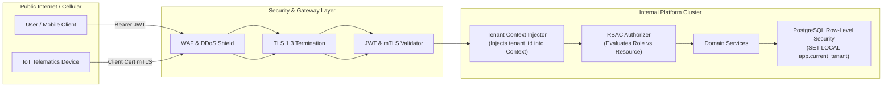
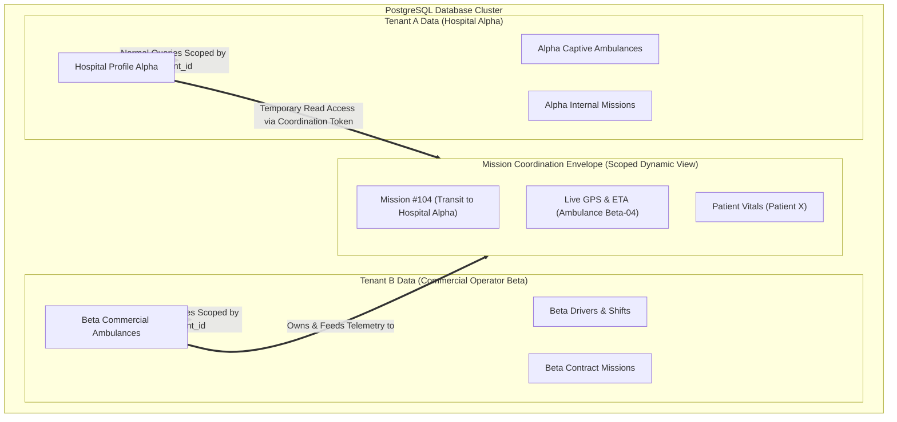

# Architecture Diagrams Specification

**Status:** APPROVED FOR PHASE 0  
**Notice:** All diagrams represent concrete architectural components, boundaries, and data flows.

---

## 1. System Context Diagram (C4 Context)



---

## 2. High-Level Container Architecture (C4 Container)



---

## 3. Organization Hierarchy & Multi-Tenancy Boundary



---

## 4. Mission Lifecycle State Diagram



---

## 5. Ambulance-to-Backend Data Flow (Telemetry Pipeline)



---

## 6. Patient Vitals Ingestion & Clinical Alert Pipeline



---

## 7. Hospital Pre-Arrival Coordination Flow



---

## 8. Authentication & Authorization Boundary



---

## 9. Multi-Tenant Data Boundary & Cross-Tenant Coordination



---

## 10. MVP End-to-End Sequence Diagram (The Golden Path)

```mermaid
sequenceDiagram
    autonumber
    actor Admin as Hospital Admin / Dispatcher
    actor Driver as Ambulance Driver
    actor Nurse as Receiving Hospital Triage Nurse
    participant Platform as Ambulance Coordination Platform
    participant Sim as Vitals Simulator Engine

    Admin->>Platform: 1. Create Mission (Pickup Pin, Trauma Urgency, Dest: Apex Hospital)
    Platform->>Platform: 2. State: REQUESTED -> DISPATCHING -> ASSIGNED
    Platform->>Driver: 3. High-Priority Push Notification: "New Emergency Mission"
    Driver->>Platform: 4. Driver taps "ACCEPT MISSION" (State: ACCEPTED -> EN_ROUTE_PICKUP)
    
    loop Active Transit to Pickup
        Driver->>Platform: 5. Background GPS coordinates streamed every 3s
        Platform->>Admin: 6. Live ambulance marker moving on Dispatch map
    end

    Driver->>Platform: 7. Driver taps "ARRIVED PICKUP" -> "PATIENT ONBOARD"
    Platform->>Sim: 8. Trigger Vitals Simulation (Scenario: Acute Hypoxia)
    Sim->>Platform: 9. Stream Vitals: HR 126 bpm, SpO2 87%, BP 90/60 mmHg
    Platform->>Platform: 10. NEWS2 Score calculated = 8 (High Alert)
    Platform->>Nurse: 11. WebSocket Alert: Pre-Arrival Radar Card (ETA 9m, High Acuity)
    Nurse->>Nurse: 12. Nurse prepares Resuscitation Bay 1
    
    Driver->>Platform: 13. Driver taps "ARRIVED HOSPITAL" (State: ARRIVED_HOSPITAL)
    Nurse->>Platform: 14. Nurse opens Handover Screen & acknowledges patient receipt
    Driver->>Platform: 15. Driver confirms Handover (State: COMPLETED)
    Platform->>Platform: 16. Vehicle returned to AVAILABLE; Mission sealed in Audit Log
```
